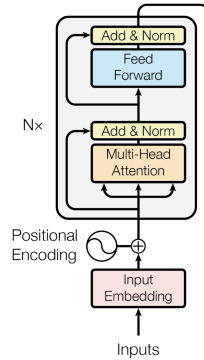
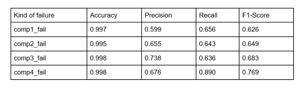

## Transformer model for Microsoft Azure Predictive Maintenance Dataset

For this problem, the Transformer model, which contains a decoder block (2 nodes), was used for the Microsoft Azure Predictive Maintenance dataset. This is a Time Series problem, and the gold of this problem is predicting different kinds of failures (PdM_failures.csv file).
A time series problem needs a window of data for a period of time (in this case, 24 records) and labels for training. There are four kinds of failures for this problem, and each label represents a kind of replacement of a component due to failure: comp1_fail, comp2_fail, comp3_fail, and comp4_fail. 
The shape of the data was (number_of_records, 24, 14) which is (batch size, sequence length, feature length)
### Transformer Model: 
Structure: This Transformer model only contains an encoder block.  The encoder block uses the self-attention mechanism to enrich each token with contextual information from the whole sentence. But, this model did not contain Embedding layer.

### Performance: 
Accuracy, precision, recall, and F1-Score were calculated for four kinds of failure. Table shows the performance for each one.

### Web Application:
As I mentioned, this is a Time-series problem, so it needs 24 records to predict, but this will be very huge information that each user must input for testing the web application. So, we use saved records, including 23 records (TEST size: [23, 14]) and by getting a new record from the user, the time series will be [24, 14] (TEST size: [24, 14]), so model can take this data as a new time series for the model. The video shows that the Web Application works well.

https://github.com/ghassemi1/Transformer-Model-Predictive-Maintenance/assets/109998808/bd236d96-2e43-4f73-ac0e-27f8fb7b74a5

